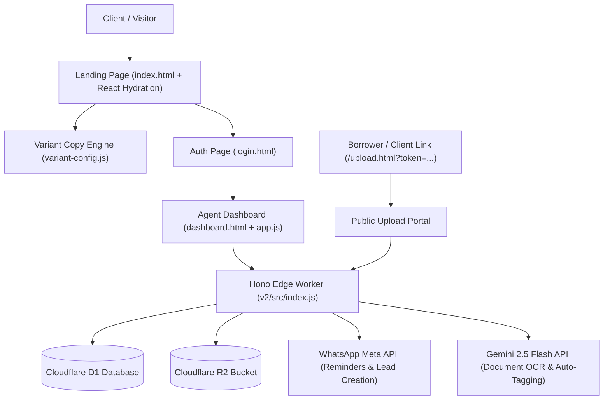
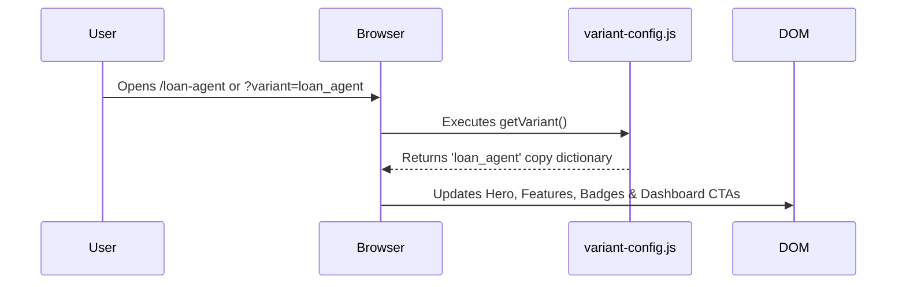
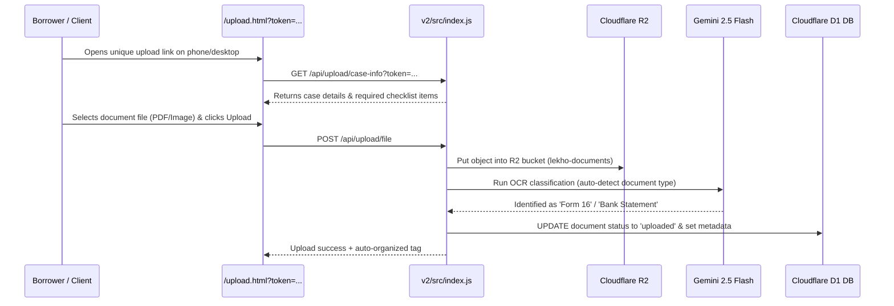

# Collectrr (V2 Edge Architecture) — Code Flow & Directory Map

Welcome to the Collectrr codebase! This document provides a high-level overview, component directory map, request execution flows, and key system concepts so any developer can immediately understand how the code functions.

---

## 1. High-Level Architecture Overview

Collectrr is a serverless, edge-deployed document intake & automation platform built for **Chartered Accountants (CAs)** and **Loan Brokers / DSAs**.



### Key Technologies:
- **Runtime & Deployment**: Cloudflare Workers + Hono Web Framework
- **Database**: Cloudflare D1 (SQLite SQL at the edge)
- **File Storage**: Cloudflare R2 (S3-compatible Object Storage for document uploads)
- **Frontend**: Vanilla HTML/JS + Lightweight React hydration (Vite asset bundle)
- **Automations**: Meta WhatsApp Business API for client reminders & Gemini 2.5 Flash for document OCR

---

## 2. Directory Structure & File Responsibilities

```
Lekho-Edge/
├── CODE_FLOW.md                   <-- You are here! Architectural & flow guide
├── README.md                      <-- Project setup, dev server, deployment instructions
└── v2/                            <-- Main Collectrr V2 Edge Application
    ├── wrangler.toml              <-- Cloudflare Worker configuration & resource bindings
    ├── migrations/                <-- D1 Database SQL schema migrations
    ├── tests/                     <-- Node.js TAP integration & unit test suite
    ├── src/                       <-- Backend Edge Server (Hono)
    │   ├── index.js               <-- Worker Entry point & main HTTP route dispatcher
    │   ├── api/                   <-- Modular REST API routes
    │   │   ├── auth.js            <-- User login, registration, password hashing
    │   │   ├── cases.js           <-- Case collection lifecycle & document checklists
    │   │   ├── upload.js          <-- Public upload link handler & R2 storage upload
    │   │   ├── ocr.js             <-- Gemini Flash 2.5 OCR extraction & document classifier
    │   │   ├── webhook.js         <-- Meta WhatsApp webhook listener & verification
    │   │   ├── admin.js           <-- Observability & analytics endpoints
    │   │   └── session.js         <-- JWT auth middleware & dev-mode session helper
    │   └── db/                    <-- Database access helpers & D1 query abstractions
    └── public/                    <-- Frontend Static Web Assets & Single Page Portals
        ├── index.html             <-- Landing page HTML markup
        ├── dashboard.html         <-- Agent Operations Dashboard UI
        ├── case.html              <-- Individual Case Detail & Document Review UI
        ├── login.html             <-- Authentication Sign-in page
        ├── register.html          <-- Registration page
        ├── upload.html            <-- Public Client/Borrower Upload Link Portal
        ├── css/                   <-- Custom CSS styles (dashboard.css, case-detail.css)
        ├── js/                    <-- Client-side JavaScript controllers
        │   ├── variant-config.js  <-- Central copy matrix for Loan Agent vs CA personas
        │   ├── app.js             <-- Dashboard state machine & case management JS
        │   ├── case-detail.js     <-- Case detail page JS controller
        │   ├── icons.js           <-- Lucide SVG icon generators
        │   └── ui-components.js   <-- Shared UI components (modal, toast, badges)
        └── assets/                <-- Vite production bundled JS/CSS assets
```

---

## 3. Key Execution Flows

### A. Persona Variant Flow (Loan Agent vs. CA Copy)

The application supports multiple audience variants (e.g. `ca` for Chartered Accountants, `loan_agent` for Loan Brokers / DSAs).

1. **Detection**: `variant-config.js` inspects:
   - URL path (`/ca` vs `/loan-agent`)
   - URL query string (`?variant=loan_agent` vs `?variant=ca`)
   - LocalStorage saved persona (`user_variant`)
2. **Rendering**:
   - `index.html` updates landing hero headline, badge, subtitle, and checklist templates.
   - `dashboard.html` updates page titles, table headers (`Loan Cases` vs `Client Collections`), and primary action buttons (`+ New Loan Case` vs `+ New Collection`).



---

### B. Client Document Upload Flow



---

### C. WhatsApp Automated Follow-Up Lifecycle

1. Agent creates a new collection case via the 3-Screen Wizard on `dashboard.html`.
2. Hono Worker triggers `sendWhatsAppTemplate()` calling Meta WhatsApp Graph API.
3. Client receives direct WhatsApp message with individual upload URL (`collectr.in/upload.html?token=...`).
4. If client has pending items after 48 hours, background job triggers reminder template. Hard limit capped at 3 follow-ups max.

---

## 4. Authentication & Dev Mode

- **Production Mode**: Employs JWT bearer tokens stored in HTTP headers (`Authorization: Bearer <token>`).
- **Dev Bypass Mode**: On `localhost` or `127.0.0.1`, requests automatically attach `Bearer dev_token` if unauthenticated, granting admin privileges (`DevAgent (admin)`).

---

## 5. Adding New Features or Modifying Copy

- **Adding a new Persona Variant**:
  1. Open [`variant-config.js`](file:///Users/aaryanshah/Downloads/Lekho-Edge/v2/public/js/variant-config.js).
  2. Add key under `VARIANT_COPY` (e.g. `legal_intake`).
  3. Define section headlines, badges, bullet points, and CTA text.
  4. Run `npm test` in `v2/` to ensure full copy key coverage.
