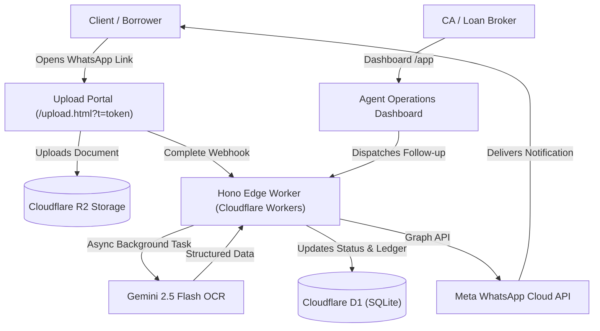
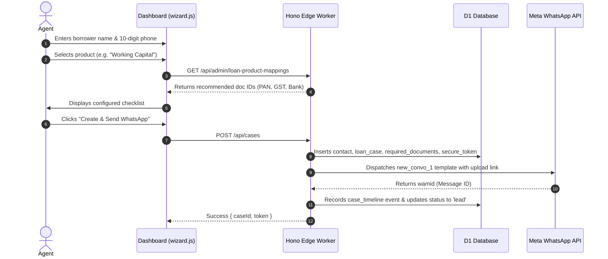
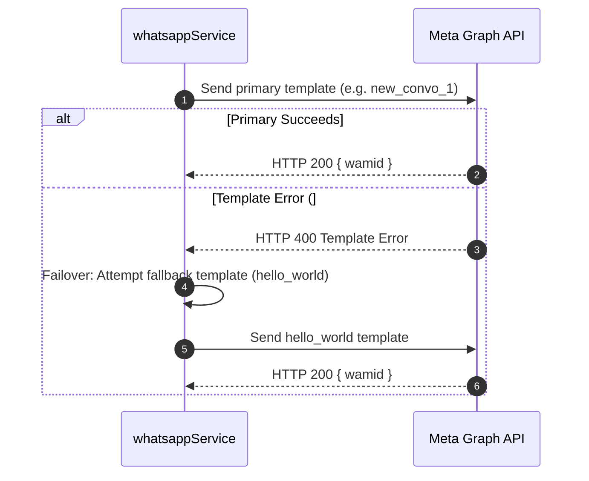
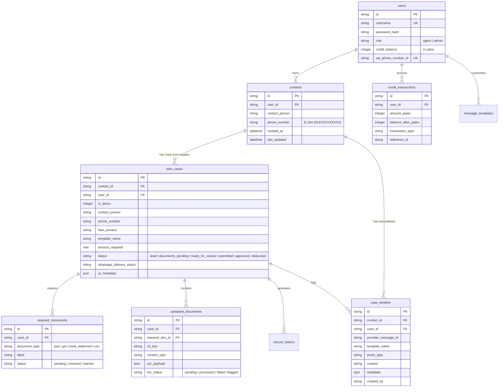

# Collectrr V2 — Technical Architecture & System Guide

Welcome to the Collectrr architectural and engineering guide. This document provides an exhaustive, authoritative breakdown of how Collectrr works under the hood for contributors, architects, and engineers modifying the system.

---

## 1. System Vision & Domain Model

Collectrr is a serverless, edge-deployed document collection, intake, and client coordination platform built for two primary financial personas:
1. **Chartered Accountants (CAs)**: Automating periodic compliance collection (ITR filing documents, GST monthly returns, Tax Audit schedules).
2. **Loan Brokers & DSAs**: Streamlining borrower documentation (PAN, Aadhaar, salary slips, bank statements, property papers).

### Core Problem Solved
Traditional document collection involves endless back-and-forth email/WhatsApp chasing, uncompressed images, missing paperwork, and manual verification. Collectrr automates:
- Direct WhatsApp outreach using Meta Cloud API templates with dynamic upload tokens.
- Mobile-first client upload portal with zero login friction.
- Object storage presigned uploads to Cloudflare R2.
- Automated OCR verification using Gemini 2.5 Flash to classify documents, extract structured fields, detect anomalies, and auto-advance case review statuses.

---

## 2. Architecture & Tech Stack



### Component Stack
| Layer | Technology | Purpose |
|---|---|---|
| **Edge Compute** | Cloudflare Workers + Hono v4 | Ultra-low latency API routing and static asset delivery at edge points of presence worldwide. |
| **Database** | Cloudflare D1 (Edge SQLite) | ACID transactional database storing cases, timeline events, contacts, templates, and credit ledgers. |
| **Blob Storage** | Cloudflare R2 | S3-compatible, zero-egress fee object storage for client documents. |
| **Messaging** | Meta WhatsApp Business Cloud API | Direct notification templates and 24-hour two-way client chat. |
| **AI Extraction** | Google Gemini 2.5 Flash | Multimodal document parsing, anomaly detection, and structured field extraction. |
| **Frontend** | Vanilla JS + Modern Design System | Zero-framework-overhead, highly responsive operations dashboard and mobile upload portal. |

---

## 3. Directory Map & Component Responsibilities

```text
Lekho-Edge/
├── README.md                          # Repository overview, quickstart & dev commands
├── PROJECT_OVERVIEW.md                # This document: architecture, flows & contracts
├── CONTRIBUTING.md                    # Contributor guide & coding standards
├── SECURITY.md                        # Vulnerability reporting & key rotation policy
├── BASELINE.md                        # Cryptographic test baseline inventory
├── LICENSE                            # Open source license (MIT)
├── package.json                       # Root developer entry point
│
└── v2/                                # Active Collectrr V2 Edge Application
    ├── package.json                   # Edge worker package definition & scripts
    ├── wrangler.toml                  # Cloudflare Worker bindings (sanitized)
    ├── wrangler.toml.example          # Example deployment configuration
    ├── .dev.vars.example              # Example local secrets with mock flags
    │
    ├── migrations/                    # D1 Database Migrations (0001 → 0007)
    │   ├── 0001_initial_v1_schema.sql
    │   ├── 0002_add_users_and_multi_tenancy.sql
    │   ├── 0003_refactor_lead_to_case_tokens.sql
    │   ├── 0004_freemium_messaging_credits.sql
    │   ├── 0005_custom_message_templates.sql
    │   ├── 0006_contacts_and_mini_targets.sql
    │   └── 0007_loan_product_doc_mappings.sql
    │
    ├── src/                           # Backend Application Code
    │   ├── index.js                   # Worker entrypoint, router dispatcher & redirects
    │   ├── middleware/
    │   │   ├── auth.js                # JWT session verification & dev-mode bypass
    │   │   └── cors.js                # CORS headers & preflight handler
    │   ├── api/                       # REST API controllers
    │   │   ├── auth.js                # Login, registration, password hashing
    │   │   ├── cases.js               # Case CRUD, document checklists, Excel/CSV import
    │   │   ├── contacts.js            # Contact directory & timeline consolidation
    │   │   ├── upload.js              # Token validation, presigned R2 URLs, direct upload
    │   │   ├── ocr.js                 # Gemini 2.5 Flash OCR trigger & mock adapter
    │   │   ├── templates.js           # WhatsApp template CRUD & uniqueness enforcement
    │   │   ├── credits.js             # Financial ledger, recharge wallet, paise math
    │   │   ├── webhook.js             # Meta webhook verification & delivery status parser
    │   │   └── admin.js               # Matrix rule editor & failure log viewer
    │   ├── whatsapp/
    │   │   ├── client.js              # Meta Graph API client & offline mock adapter
    │   │   ├── templates.js           # Template registry, token payload builder
    │   │   └── webhook.js             # Webhook payload normalization
    │   └── db/
    │       ├── client.js              # D1 client wrapper & migration self-heal
    │       └── schema.sql             # Authoritative cumulative database schema
    │
    ├── public/                        # Frontend Static Web Portals
    │   ├── index.html                 # Marketing landing page
    │   ├── dashboard.html             # Agent operations dashboard (/dashboard.html or /app)
    │   ├── case.html                  # Case detail & timeline workspace
    │   ├── upload.html                # Mobile client upload portal
    │   ├── login.html & register.html # Agent authentication views
    │   ├── css/                       # Vanilla CSS stylesheets (dashboard.css)
    │   └── js/                        # Modular frontend scripts
    │       ├── core/                  # Shared utilities
    │       │   ├── api.js             # authFetch & session handling
    │       │   ├── state.js           # Minimal global application state
    │       │   ├── dom.js             # el, escapeHtml, formatters
    │       │   └── events.js          # Event bus
    │       ├── modules/               # Feature modules
    │       │   ├── auth.js            # User profile, role badges, logout
    │       │   ├── wallet.js          # Credit balance, recharge modal, transactions
    │       │   ├── templates.js       # Template manager, live WhatsApp bubble
    │       │   └── admin.js           # Matrix configurator
    │       ├── app.js                 # Dashboard bootstrapper & event orchestrator
    │       ├── case-detail.js         # Case detail view controller
    │       ├── variant-config.js      # Persona copy definitions (CA vs loan_agent)
    │       └── ui-components.js       # Toast & confirmation dialogs
    │
    └── tests/                         # Node.js TAP Test Suite
        ├── helpers/
        │   └── network-guard.js       # Outbound network denial guard
        ├── schema-parity.test.js      # Deep schema parity verification
        ├── mock-adapters.test.js      # Offline WhatsApp & Gemini mock verification
        ├── whatsapp-workflow.test.js  # Template failover & 24h window tests
        ├── templates-ui.test.js       # Template uniqueness & live preview tests
        ├── credits.test.js            # Paise math & recharge ledger tests
        ├── bulk-import.test.js        # CSV/Excel parsing & auto-mapping tests
        ├── persona-overflow.test.js   # CA vs Loan Agent isolation tests
        ├── status-filtering.test.js   # Mode-dependent status presentation & filtering tests
        ├── wizard_ui.test.js          # 3-Screen wizard state machine tests
        ├── dom-integration.test.js    # HTML DOM element integrity tests
        ├── contact-model.test.js      # Phone normalization & contact relationship tests
        ├── route-auth.test.js         # Hono route auth, role matrix & cross-tenant isolation tests
        ├── magic-link.test.js         # Magic link session lifecycle, fingerprinting & upload tests
        └── frontend-syntax.test.js    # JS parse & syntax check
```

---

## 4. End-to-End Execution Flows

### Flow 1: Case Creation & Dynamic Document Matrix


### Flow 2: Client Magic Link & Document Upload
```mermaid
sequenceDiagram
    autonumber
    actor Client
    participant UploadPortal as Upload Portal (/upload.html)
    participant Worker as Hono Edge Worker
    participant R2 as Cloudflare R2
    participant Gemini as Gemini 2.5 Flash
    participant D1 as D1 Database

    Client->>UploadPortal: Opens link (/upload.html?t=secure_token)
    UploadPortal->>Worker: GET /api/session/:token
    Worker->>D1: Validates token active & unexpired
    Worker-->>UploadPortal: Returns case info & required document slots
    Client->>UploadPortal: Selects file to upload
    UploadPortal->>Worker: POST /api/upload-url/:token (or direct upload)
    Worker-->>UploadPortal: Presigned S3 PUT URL (or direct buffer)
    UploadPortal->>R2: Uploads binary file directly
    UploadPortal->>Worker: POST /api/upload-complete/:token
    Worker->>D1: Marks required_document status='received'
    Worker->>Gemini: Async runGeminiOcr(s3Key)
    Gemini-->>Worker: Structured extraction { anomaly, documentType, fields }
    Worker->>D1: Saves ocr_payload; if all docs received, auto-advances to 'ready_for_review'
```

### Flow 3: WhatsApp Dispatch Failover


### Flow 4: WhatsApp Template Dispatch & UI Bubble Reconstruction
```mermaid
sequenceDiagram
    autonumber
    participant Agent as Agent / Frontend
    participant API as Hono Backend (/api/cases)
    participant DB as Cloudflare D1 (SQLite)
    participant Meta as Meta WhatsApp Cloud API
    participant ClientPhone as Recipient Phone

    Agent->>API: POST /api/cases (with templateName: "do_ca")
    API->>API: Compute renderedBody = renderTemplateBody(templateName, params)
    API->>Meta: POST /messages { type: "template", template: { name: "do_ca", language: { code: "en_IN" } } }
    Note over API,Meta: Meta API does NOT accept custom text; it delivers the copy approved in WhatsApp Business Manager.
    Meta->>ClientPhone: Delivers registered copy of "do_ca"
    Meta-->>API: HTTP 200 { messages: [{ id: "wamid.xxx" }] }
    API->>DB: INSERT INTO case_timeline (event_type: "whatsapp_sent", content: renderedBody, template_name: "do_ca")
    
    Note over Agent,DB: UI Display Lifecycle (case.html / case-detail.js)
    Agent->>API: GET /api/cases/:id & GET /api/cases/:id/timeline
    API-->>Agent: Case payload { templateName: "do_ca" } and timeline events
    alt Timeline event exists (whatsapp_sent)
        Agent->>Agent: Render chat bubble with exact t.content stored in timeline
    else Fallback (events empty or pending)
        Agent->>Agent: Resolve tplName via (c.templateName || c.template_name || c.messageTemplate)
        Agent->>Agent: Display template body for resolved tplName (avoids fallback to onboarding_first_message)
    end
```

### Flow 5: Mode-Dependent Status Architecture (Single Source of Truth)
```mermaid
flowchart TD
    CaseData["Case Object (c)"] --> Helper["getDisplayStatus(c, mode)"]
    Helper --> |direct_outreach| DeliveryStatus["c.whatsappDeliveryStatus || c.whatsapp_delivery_status || 'pending'"]
    Helper --> |default (ca / loan_agent)| LifecycleStatus["c.status ('lead', 'documents_pending', ...)"]
    
    DeliveryStatus --> Dropdown["populateStatusFilter(): Sorted by WHATSAPP_STATUS_ORDER"]
    DeliveryStatus --> Filter["render(): selectedStatus !== 'all' && displayStatus !== selectedStatus"]
    DeliveryStatus --> TableBadge["render(): getWhatsAppDeliveryBadgeHtml(displayStatus)"]
    
    LifecycleStatus --> Dropdown
    LifecycleStatus --> Filter
    LifecycleStatus --> TableBadge
```
*Invariant:* **Whatever status the user sees in the Status column is exactly the status they can filter by.** Dropdown, filter evaluation, and table cell rendering all consume the single `getDisplayStatus(c, mode)` abstraction.

---

## 5. Database Schema & Entity Relationships



---

## 6. REST API Contract Specification

### Authentication & Users
- `POST /api/auth/login`: `{ username, password }` $\rightarrow$ `{ token, user }`
- `POST /api/auth/register`: `{ username, password, role }` $\rightarrow$ `{ token, user }`
- `GET /api/user/profile`: Returns authenticated user session payload.
- `GET /api/user/credits`: Returns wallet balance, messages remaining, and recent transactions.
- `POST /api/user/recharge`: `{ amountRupees }` $\rightarrow$ Adds credits to wallet ledger.

### Cases & Contacts
- `GET /api/cases`: Returns cases accessible to user (scoped by `user_id` or `is_demo=1`). Supports filtering by status, product, search text. Returns canonical `templateName` (camelCase).
- `POST /api/cases`: `{ contactPerson, phoneNumber, loanProduct, amountRequired, templateName, requiredDocIds }` $\rightarrow$ Creates case & triggers WhatsApp.
- `GET /api/cases/:id`: Detailed case view including required documents, uploads, and timeline. Resolves and returns authoritative `template: { name, displayName, renderedBody }` and `templateName`. Frontend components bind against `c.template` as the single source of truth to unify presentation across the info bar, WhatsApp conversation cards, and activity logs.
- `POST /api/cases/bulk-import`: Parses uploaded CSV/spreadsheet, deduplicates numbers, and generates cases.
- `GET /api/contacts/:id/timeline`: Consolidated timeline across all mini-targets for a contact.

### Templates
- `GET /api/templates?context=direct_outreach`: Returns system defaults and custom templates (strictly deduplicated). All system templates in `WHATSAPP_TEMPLATES` declare an explicit `body_text` matching the copy approved on Meta.
- `POST /api/admin/templates`: Creates/updates template. Enforces unique names (409 on conflict).
- `DELETE /api/admin/templates/:id`: Deletes custom templates, or deactivates system default templates (persisted with is_active = 0 in message_templates).

### Upload & Client Portal
- `GET /api/session/:token`: Validates magic link token and returns case document requirements.
- `POST /api/upload-url/:token`: Generates presigned R2 S3 URL for direct client upload.
- `POST /api/direct-upload/:token`: Fallback multipart upload through worker.
- `POST /api/upload-complete/:token`: Triggers document status change and asynchronous Gemini OCR.

### Webhooks
- `GET /api/webhook/whatsapp`: Meta webhook subscription verification (`hub.challenge`).
- `POST /api/webhook/whatsapp`: Incoming message and message delivery status updates (`sent`, `delivered`, `read`, `failed`).

---

## 7. Offline Testing & Network Isolation

Collectrr features full offline testability. When running tests with:
```bash
npm run test:offline
```
The test runner activates a strict network guard (`v2/tests/helpers/network-guard.js`) that denies all outbound network traffic by default. Services use configurable mock adapters:
- `MOCK_WHATSAPP=true`: Simulates WhatsApp dispatch without contacting Meta.
- `MOCK_GEMINI=true`: Simulates OCR extraction using synthetic fixtures without contacting Google.
